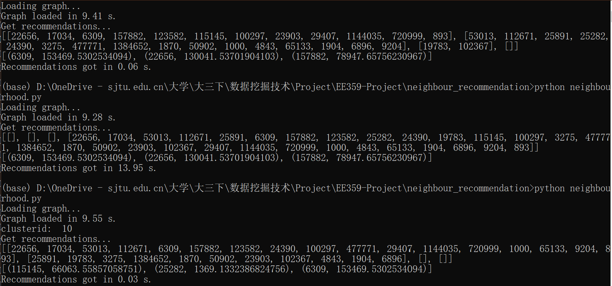

# EE359-Project
> Project of SJTU EE359 Data Mining  
> ----
> Joint query for experts in certain fields on Stackoverflow.

## Method

1. Using **Louvain** to cluster the raw graph
2. Correlate cluster to tags
3. Recommendation based on both global and local information
   1. Global: Using **weighted page rank**
   2. Local:
      1. Using **PPR** (TODO: change to **random walk**) to extract neighbourhood.
      2. Combine **Indegree** and **BFS** to retrieve local recommendations

## Current Results

Cluster result:

Local recommendationss:  
Node index 1000, cluster index 5, 99 and 10.

## TODO
1. improve BFS time
2. change PPR to random walk
3. vote to determine tags of clusters
4. test and experiments
5. report